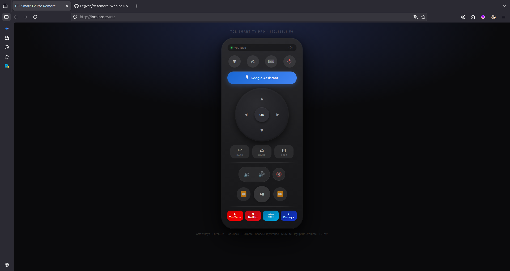

# TV Remote

A web-based remote control for **Android TV / Google TV** devices, controlled over ADB on your local network. Includes a setup wizard that finds your TV automatically.

Works with any Google TV or Android TV device — TCL, Sony, Philips, Hisense, Nvidia Shield, Chromecast with Google TV, and more.



---

## Features

- **Auto-discovery** — scans your LAN via mDNS and ADB port scan, identifies model from TLS certificate (no pairing required)
- **Web remote** — phone- and desktop-friendly UI accessible at `http://localhost:5052` on your machine or `http://<machine-ip>:5052` from any device on your LAN
- **Full controls** — D-pad, volume, media, app shortcuts (YouTube, Netflix, Prime, Disney+, Spotify)
- **Google Assistant** — launches via `am start` (most reliable method on Google TV)
- **Text input** — type search queries or passwords from your keyboard; modal opens with `T`
- **Keyboard shortcuts** — arrow keys, Enter, Escape, H (Home), M (Mute), PgUp/Dn (volume), T (text)
- **Desktop shortcut** — wizard creates a `.desktop` launcher for one-click start
- **CLI** — `./tv <command>` for scripting and quick control from the terminal

---

## Requirements

- Linux (tested on Ubuntu 24.04)
- Python 3.11+
- Your TV must have **ADB over network** enabled (one-time setup — see below)

---

## Installation

```bash
git clone https://github.com/Legvan/tv-remote.git
cd tv-remote

# Create virtualenv and install dependencies
python3 -m venv .venv
.venv/bin/pip install -r requirements.txt

# Run the setup wizard
./install
```

The wizard will:
1. Scan your network and find your TV
2. Generate an ADB RSA key pair (`~/.android/adbkey`)
3. Ask you to **Accept** the connection prompt on your TV screen
4. Write `config.json` with your TV's details
5. Create `~/.local/share/applications/tv-remote.desktop` for your app launcher

### Enable ADB on your TV (one-time)

1. **Settings → About → scroll to Build Number → press OK 7 times** → "You are now a developer"
2. **Settings → System → Developer options → ADB over network → On**

---

## Usage

### Web remote (recommended)

```bash
./remote-gui
```

Opens the browser automatically at `http://localhost:5052`. Use it from any device on your network by navigating to `http://<your-machine-ip>:5052`.

### CLI

```bash
./tv connect                  # test connection + show current state
./tv power                    # toggle power
./tv wake / sleep             # screen on / off
./tv vol-up [N] / vol-down [N]
./tv mute
./tv home / back / ok
./tv up / down / left / right
./tv play-pause / next / prev
./tv launch youtube           # also: netflix, prime, disney, spotify, kodi
./tv text "search query"      # send text to focused input field
./tv key <keycode>            # raw Android keycode
./tv shell <cmd>              # raw ADB shell command
./tv discover                 # re-scan network for TV devices
```

### Re-run setup

```bash
./install                     # switch TV, update config, recreate desktop shortcut
```

---

## How it works

```
./install
  ├── mDNS scan (_androidtvremote2._tcp) — finds Google TV devices on LAN
  ├── TLS cert probe (port 6467) — reads device name/MAC without pairing
  ├── ADB port scan (port 5555) — fallback for devices without mDNS
  ├── ADB RSA key generation (~/.android/adbkey)
  ├── ADB connection test — user accepts prompt on TV
  └── Writes config.json + .desktop file

./remote-gui
  └── Flask server (port 5052)
        ├── Serves static HTML remote UI
        └── REST API → adb_client.py → ADB over TCP → TV
```

All ADB communication is **direct TCP** (no system `adb` daemon needed — pure Python via `adb-shell`).

---

## Project structure

```
tv-remote/
├── install          # Setup wizard (run this first)
├── remote-gui       # Launch web GUI
├── tv               # CLI wrapper
├── scripts/
│   ├── install.py          # Wizard: scan → pair → config → desktop
│   ├── discover.py         # Network scanner (importable)
│   ├── adb_client.py       # ADB connection wrapper (reads config.json)
│   ├── remote_server.py    # Flask server + REST API
│   ├── tv.py               # CLI implementation
│   ├── keygen.py           # ADB RSA key generator
│   └── static/index.html   # Web remote UI
└── docs/                   # Protocol notes, keycode reference
```

---

## Notes

- **Unicode text input is not supported** — Android's `adb shell input text` only handles ASCII. For full Unicode support, [ADBKeyBoard](https://github.com/senzhk/ADBKeyBoard) would need to be installed on the TV.
- **Google Assistant button** uses `am start` directly (more reliable than keycode 84 which is a voice-streaming protocol trigger, not a UI launcher).
- `config.json` is in `.gitignore` — it contains your TV's IP and MAC address and is never committed.

---

## Security model

The Flask server binds to `0.0.0.0` and is reachable by any device on your local network — intended so you can use it from a phone or tablet. It should not be exposed to the internet (use your router/firewall to keep it LAN-only). All ADB communication stays on your local LAN. No credentials, tokens, or personal data are stored in the repository — `config.json` (TV IP and MAC) is gitignored and written locally by `./install`.

## License

MIT
